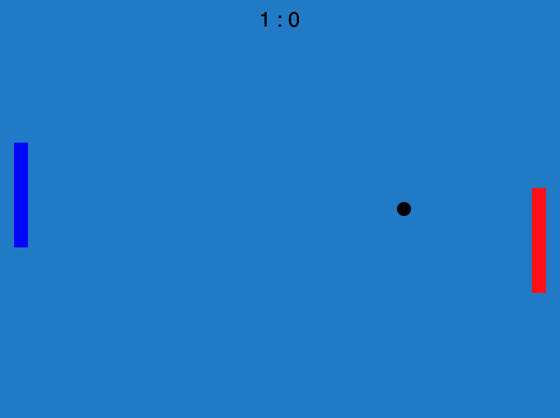

# Pong with Excalibur.js in TypeScript



## Setup and Installation

```bash
# Install dependencies
npm install

# Run the game
npm run start

# go to localhost:1234 in your browser of choice
# Play the Game!

```

### Credits and References

- This project was created by using the [Excalibur TypeScript Parcel Template](https://github.com/excaliburjs/template-ts-parcel-v2/generate)
